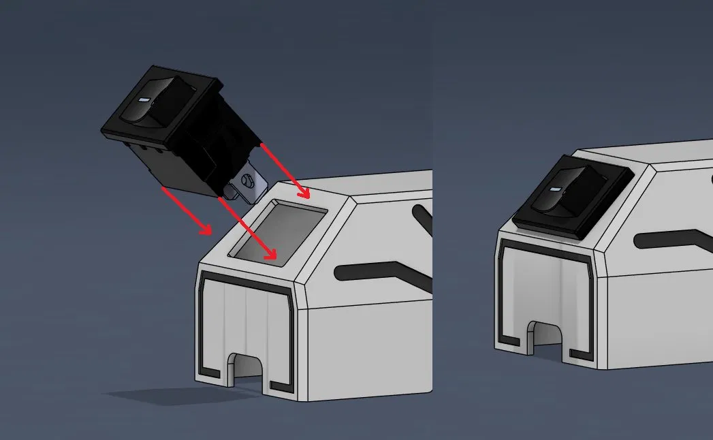
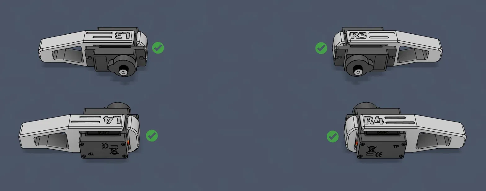
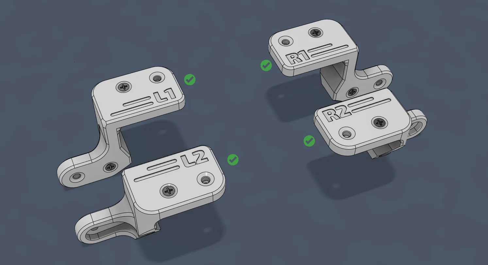
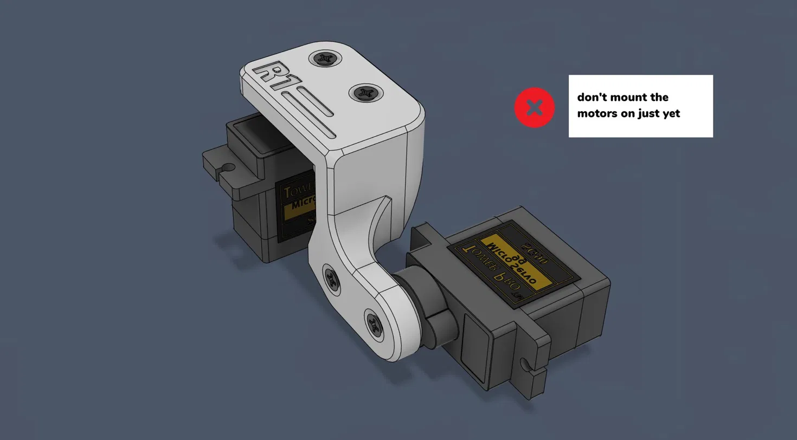
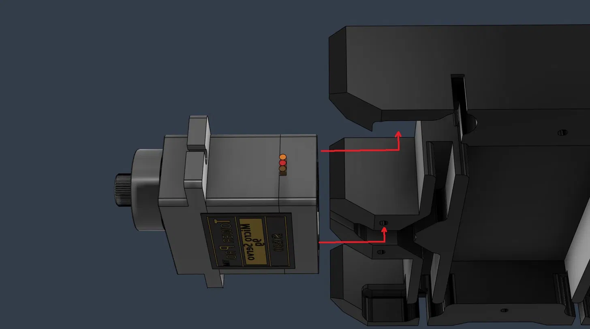
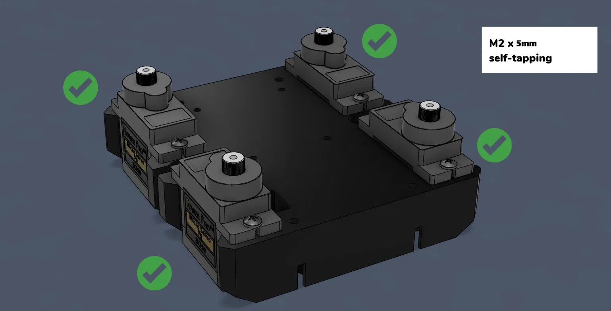
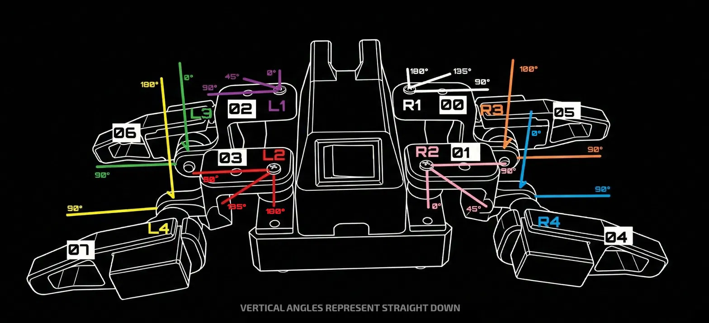
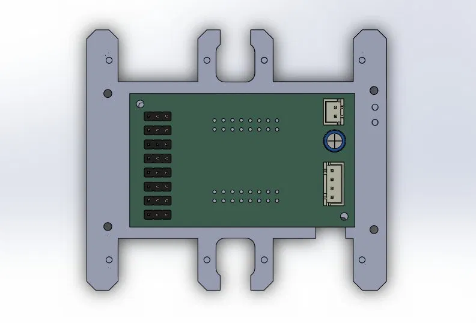

# Sesame Robot — Build Guide (Custom Variant)

> Basado en el proyecto original [dorianborian/sesame-robot](https://github.com/dorianborian/sesame-robot) con modificaciones propias: alimentación por batería LiPo 2S con regulador LM2596, PCB personalizada y soporte para pantalla OLED con JST.

---

## Tabla de contenido

1. [Visión general](#1-visión-general)
2. [BOM — Lista de materiales](#2-bom--lista-de-materiales)
3. [Impresión 3D](#3-impresión-3d)
4. [Fase 1 — Electrónica: soldadura de la PCB](#4-fase-1--electrónica-soldadura-de-la-pcb)
5. [Fase 2 — Sistema de alimentación](#5-fase-2--sistema-de-alimentación)
6. [Fase 3 — Ensamblaje mecánico](#6-fase-3--ensamblaje-mecánico)
7. [Fase 4 — Montaje de la electrónica en el cuerpo](#7-fase-4--montaje-de-la-electrónica-en-el-cuerpo)
8. [Fase 5 — Calibración de servos](#8-fase-5--calibración-de-servos)
9. [Fase 6 — Firmware](#9-fase-6--firmware)

---

## 1. Visión general

El robot es un cuadrúpedo miniatura con 8 servos (2 por pata), controlado por un ESP32-S2 Mini (Lolin). La variante descrita aquí usa:

- Batería LiPo 2S (2× celda 14500 en battery holder 2S) → regulador buck LM2596 → 5 V para toda la electrónica.
- PCB de distribución personalizada con conectores JST XH 2.54 mm.
- Pantalla OLED SSD1306 0.96″ conectada por JST de 4 pines.
- Switch de encendido integrado en el top cover.

---

## 2. BOM — Lista de materiales

### Electrónica

| Componente | Especificación | Cant. |
|---|---|---|
| Microcontrolador | Lolin ESP32-S2 Mini | 1 |
| Servos | Tower Pro MG90S (o equivalente micro servo) | 8 |
| Pantalla OLED | SSD1306 0.96″, I2C | 1 |
| Regulador buck | LM2596 (módulo ajustable) | 1 |
| Batería | LiPo 14500 3.7 V × 2 (en battery holder 2S) | 2 |
| Switch | Rocker switch, enclave, 2 pines | 1 |

### Conectores y pasivos (para la PCB)

| Componente | Especificación | Cant. |
|---|---|---|
| Regleta hembra 2.54 mm | Para montar el ESP32-S2 Mini | 2 (según pinout) |
| Regleta macho 2.54 mm | Para señal de cada servo (S/VCC/GND por canal) | 8 × 3 pines |
| JST XH 2.54 mm 2 pines | Entrada de 5 V desde el buck | 1 |
| JST XH 2.54 mm 4 pines | Pantalla OLED (VCC, GND, SDA, SCL) | 1 |
| Cable 30 AWG | Señal | c/n |
| Cable 22 AWG | Potencia (VCC/GND servos y alimentación) | c/n |

### Hardware mecánico

| Componente | Especificación | Cant. |
|---|---|---|
| Tornillos autoroscantes | M2 × 5 mm | 10 |
| Tornillos métricos | M3 × 5 mm | 4 (regulador en techo) |
| Tuercas M3 | Para el regulador | 4 |

### Partes impresas en 3D

| Pieza | Cantidad |
|---|---|
| Marco interno (Internal Frame) | 1 |
| Top Cover | 1 |
| Bottom Cover | 1 |
| Joint L1, L2, L3, L4 | 1 c/u |
| Joint R1, R2, R3, R4 | 1 c/u |

---

## 3. Impresión 3D

Imprime todas las piezas antes de empezar el ensamblaje.

- **Material:** PLA (recomendado)
- **Relleno:** 30–40%
- **Capa:** 0.2 mm
- **Soportes:** Revisar el printing guide del repo original para orientaciones específicas del top cover

El set completo son **11 piezas impresas**: marco interno, top cover, bottom cover, y 8 joints (L1–L4, R1–R4).

![Componentes del robot]    
*Vista general de todos los componentes mecánicos e impresos*

---

## 4. Fase 1 — Electrónica: soldadura de la PCB

> Hazlo antes de tocar el ensamblaje mecánico. Con la PCB lista el cableado interno es mucho más limpio.

### 4.1 Montar el ESP32-S2 Mini

Solda dos **regletas hembra de 2.54 mm** en la PCB para que el ESP32-S2 Mini quede en zócalo (desmontable). El ESP32-S2 Mini requiere un reset manual para flashear (no tiene DTR/RTS automático), así que dejarlo desmontable facilita la vida.

### 4.2 Regletas para servos

Por cada uno de los 8 servos, solda una **regleta macho de 3 pines** (Señal / VCC / GND). Etiquétalas del 0 al 7 según el mapa de pines del firmware. Los servos L1–L4 y R1–R4 conectan aquí.

### 4.3 Conector de alimentación (entrada 5 V)

Solda un **JST XH 2.54 mm de 2 pines** para recibir los 5 V desde la salida del regulador LM2596. Esta es la única fuente de alimentación de toda la PCB (ESP32 + servos).

### 4.4 Conector de pantalla OLED

Solda un **JST XH 2.54 mm de 4 pines** con el siguiente orden:

```
Pin 1 → VCC (3.3 V o 5 V según la pantalla)
Pin 2 → GND
Pin 3 → SDA  (GPIO 33 en el S2 Mini por defecto)
Pin 4 → SCL  (GPIO 35 en el S2 Mini por defecto)
```

> Verificar el pinout exacto en el archivo de firmware antes de soldar.

### 4.5 Checklist de PCB

- [ ] ESP32-S2 Mini en zócalo, sin cortocircuitos visibles
- [ ] 8 regletas de servo soldadas y etiquetadas (0–7)
- [ ] JST 2 pines de alimentación
- [ ] JST 4 pines de OLED con orden VCC/GND/SDA/SCL correcto

---

## 5. Fase 2 — Sistema de alimentación

### 5.1 Batería

Usa **2 celdas 14500** (3.7 V cada una) en un **battery holder 2S**. Con ambas en serie obtienes ~7.4 V nominal (8.4 V cargadas). El holder va en la cavidad del Bottom Cover.

### 5.2 Regulador LM2596

El LM2596 convierte los 7.4–8.4 V de la batería a **5 V estables** para todo el sistema.

**Procedimiento de ajuste (trimear) antes de instalar:**

1. Conecta la batería (sin carga) al input del LM2596.
2. Con un multímetro en la salida, ajusta el **potenciómetro** del módulo hasta leer exactamente **5.0 V**.
3. Verifica con una carga leve (ej. una resistencia de 10 Ω) que la tensión se mantiene estable.

**Instalación:** El regulador se monta en el interior del top cover, pegado al techo, sujeto con **4 tornillos M3 × 5 mm** + tuercas. Deja espacio para que el potenciómetro quede accesible si necesitas reajustar.

### 5.3 Switch de encendido

El rocker switch se integra en el top cover. Se corta el positivo de la batería y se interrumpe con el switch — cuando está en OFF desconecta completamente el pack.


*El switch encaja en la ranura del top cover presionando desde arriba*

---

## 6. Fase 3 — Ensamblaje mecánico

### 6.1 Montaje de servos en joints L3, L4, R3, R4 (patas traseras/delanteras, motor lateral)

Cada joint lateral (L3/R3 = muslo, L4/R4 = tibia) recibe un servo con el **engranaje apuntando hacia arriba** desde la perspectiva de la pata.


*Check verde = orientación correcta del servo en cada joint*

Fijación: **2× M2 × 5 mm autoroscantes** por servo (los orificios de montaje del servo encajan en el slot del joint).

### 6.2 Montaje de servos en joints L1, L2, R1, R2 (cadera)

Los joints de cadera son la articulación entre el cuerpo y la pata. Se montan en pares (L1+L2 lado izquierdo, R1+R2 lado derecho).


*Los cuatro joints de cadera, verificados con check verde*

> ⚠️ En este punto **NO montes todavía los servos** en los joints de cadera. Primero van los joints al frame, después los servos. Ver imagen de referencia:



### 6.3 Montaje en el marco interno

Los servos de cadera (motores 1–4, que corresponden a L1/L2/R1/R2) se insertan en el internal frame desde abajo. El servo desliza hacia arriba dentro de su slot, con las pestañas del servo encajando en las guías del frame.




*4 servos fijados al frame con M2 × 5 mm self-tapping, check verde en cada esquina*

### 6.4 Verificación de orientación antes de continuar

Con los joints y el frame armados, revisa que la geometría de patas corresponda al diagrama de ángulos. **Todos los servos deben estar a 90° para el ensamblaje inicial** (posición neutra):


*Mapa de ángulos objetivo por servo. "Vertical angles represent straight down"*

---

## 7. Fase 4 — Montaje de la electrónica en el cuerpo

### 7.1 PCB en el internal frame

La PCB de distribución va en el internal frame. Alinea los orificios de montaje y fija con tornillos M2.



### 7.2 Regulador en el top cover

El LM2596 va en el interior del top cover, pegado al techo. Sujétalo con los **4 M3 × 5 mm** mencionados en la Fase 2.

### 7.3 Pantalla OLED

La pantalla tiene un soporte impreso que la fija en la ranura frontal del top cover. Conecta el cable JST de 4 pines que va de la pantalla a la PCB.

### 7.4 Batería en el bottom cover

El battery holder 2S va en la cavidad del bottom cover. El cable positivo pasa por el switch antes de llegar al input del LM2596.

---

## 8. Fase 5 — Calibración de servos

Antes de poner los brazos de servo (servo horns) en su posición definitiva, todos los servos deben estar en **90°**.

1. Flashea `sesame-motor-tester.ino` (debugging firmware) al ESP32-S2 Mini via Arduino IDE.
2. Abre el Serial Monitor a 115200 baud.
3. Sigue el menú para mover cada servo individualmente a 90°.
4. Anota el offset de cada canal si el servo no queda perfectamente centrado.
5. Fija el servo horn con los servos ya en 90° antes de cerrar las articulaciones.

> Los offsets se ajustan en los parámetros de configuración del firmware principal.

---

## 9. Fase 6 — Firmware

### 9.1 Requisitos

- Arduino IDE con soporte para ESP32 (board manager: `https://raw.githubusercontent.com/espressif/arduino-esp32/gh-pages/package_esp32_index.json`)
- Board seleccionada: **LOLIN S2 Mini**

### 9.2 Flash del firmware principal

```bash
# Clonar el repo
git clone https://github.com/dorianborian/sesame-robot.git
cd sesame-robot/firmware
```

Abre `sesame-firmware-main.ino` en Arduino IDE y carga al ESP32-S2 Mini.

> ⚠️ El S2 Mini **no tiene DTR/RTS automático**. Para entrar en modo bootloader: mantén presionado **BOOT**, presiona y suelta **RST**, luego suelta **BOOT**. Después de flashear, presiona RST una vez para arrancar.

### 9.3 Control

Una vez encendido, el ESP32 levanta un **Access Point WiFi**. Conéctate desde tu teléfono a la red del robot y accede a la IP del AP (normalmente `192.168.4.1`) para ver el control web.


## Checklist final de ensamblaje

- [ ] PCB soldada y revisada sin cortocircuitos
- [ ] Regulador LM2596 trimeado a 5.0 V
- [ ] Switch probado (corta el positivo correctamente)
- [ ] Todos los servos centrados a 90° con `sesame-motor-tester`
- [ ] Joints y servos orientados según el diagrama de ángulos
- [ ] OLED conectada y mostrando algo al encender
- [ ] Firmware principal cargado, WiFi AP activo
- [ ] Batería colocada en el bottom cover, robot cierra correctamente

---

*Basado en [dorianborian/sesame-robot](https://github.com/dorianborian/sesame-robot). Variante con LiPo 2S + LM2596 + PCB de distribución personalizada.*
